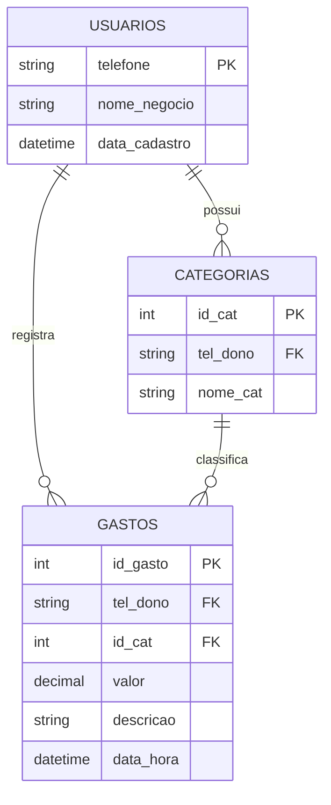

## 🏗️ 1. Arquitetura e Fluxo do Sistema

```mermaid
flowchart TD
    Cliente([Cliente no WhatsApp]) --> MetaAPI[API Oficial WhatsApp]
    MetaAPI --> Python[FastAPI Python de back-end]
    Python --> DB[(Banco PostgreSQL)]
    Python --> IA[Inteligência Artificial Gemini]
    IA --> Python
    Python --> DB
    Python --> MetaAPI
    MetaAPI --> Cliente
```

---
## 🗄️ 2. Modelagem de Dados (DER)

```mermaid
erDiagram
    USUARIOS ||--o{ CATEGORIAS : possui
    USUARIOS ||--o{ GASTOS : registra
    CATEGORIAS ||--o{ GASTOS : classifica

    USUARIOS {
        string telefone PK
        string nome_negocio
        datetime data_cadastro
    }

    CATEGORIAS {
        int id_cat PK
        string tel_dono FK
        string nome_cat
    }

    GASTOS {
        int id_gasto PK
        string tel_dono FK
        int id_cat FK
        decimal valor
        string descricao
        datetime data_hora
    }
```
