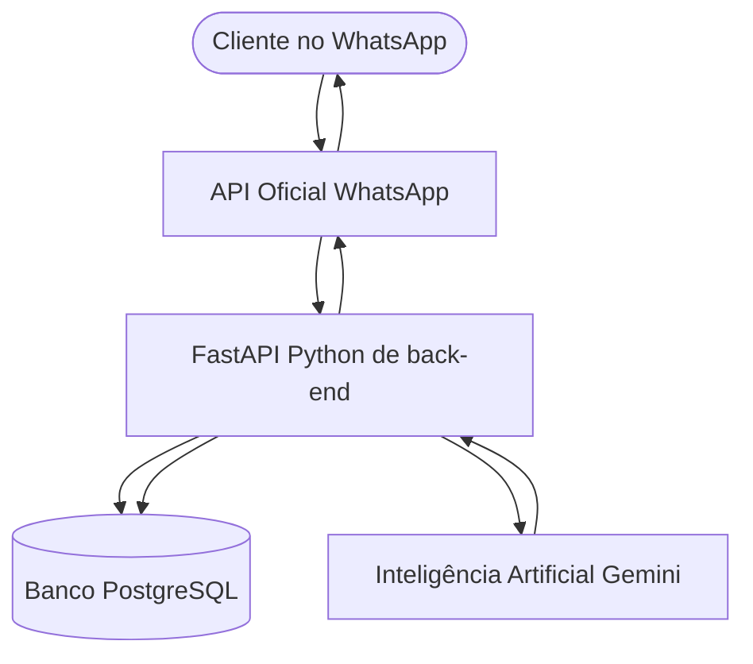
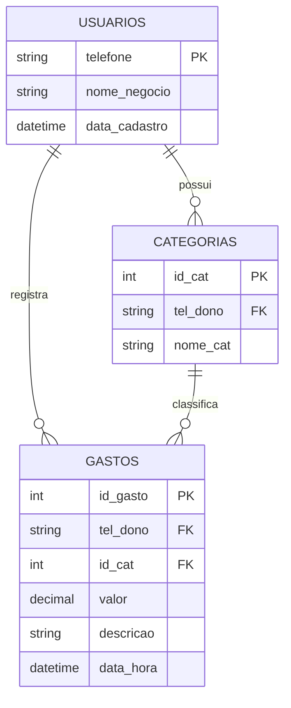

## 📋 1. Requisitos do Sistema

### 📌 Requisitos Funcionais (RF)

- **RF01 - Recepção de Mensagens via Webhook:** O sistema deve receber mensagens de texto enviadas pelos usuários através da API oficial do WhatsApp (Meta Cloud).
- **RF02 - Processamento de IA:** O sistema deve enviar o texto bruto da mensagem para a Inteligência Artificial extrair o valor monetário e a descrição do gasto.
- **RF03 - Cadastro Automático de Usuário:** O sistema deve identificar o número de telefone remetente; caso o usuário não exista, deve cadastrá-lo automaticamente na base de dados.
- **RF04 - Gestão de Categorias:** O usuário deve poder ter categorias padrão ou personalizadas para classificar seus lançamentos financeiros.
- **RF05 - Registro de Gastos:** O sistema deve salvar na tabela de gastos o valor, a descrição, a categoria correspondente, a identificação do dono e a data/hora exata da transação.
- **RF06 - Confirmação via WhatsApp:** O sistema deve responder ao usuário no WhatsApp confirmando que o gasto foi registrado com sucesso.

### ⚙️ Requisitos Não Funcionais (RNF)

- **RNF01 - Desempenho e Latência:** O tempo de resposta total entre o envio da mensagem pelo usuário e a confirmação do bot deve ser inferior a 5 segundos.
- **RNF02 - Linguagem e Framework:** O back-end do sistema deve ser desenvolvido obrigatoriamente em Python utilizando o framework FastAPI para garantir alta performance assíncrona.
- **RNF03 - Armazenamento Relacional:** Os dados persistidos devem ser armazenados em um banco de dados relacional PostgreSQL utilizando integridade referencial com Chaves Primárias (PK) e Estrangeiras (FK).
- **RNF04 - Segurança e Credenciais:** As chaves de API da Meta, do Gemini e as strings de conexão do banco de dados devem ser mantidas em variáveis de ambiente (`.env`), nunca expostas no código-fonte.
- **RNF05 - Escalabilidade da API:** A arquitetura da API deve ser modular, permitindo futuras expansões para aplicativos móveis ou novas plataformas de chat.

---

## 🏗️ 1. Arquitetura e Fluxo do Sistema

---
## 🗄️ 2. Modelagem de Dados (DER)

